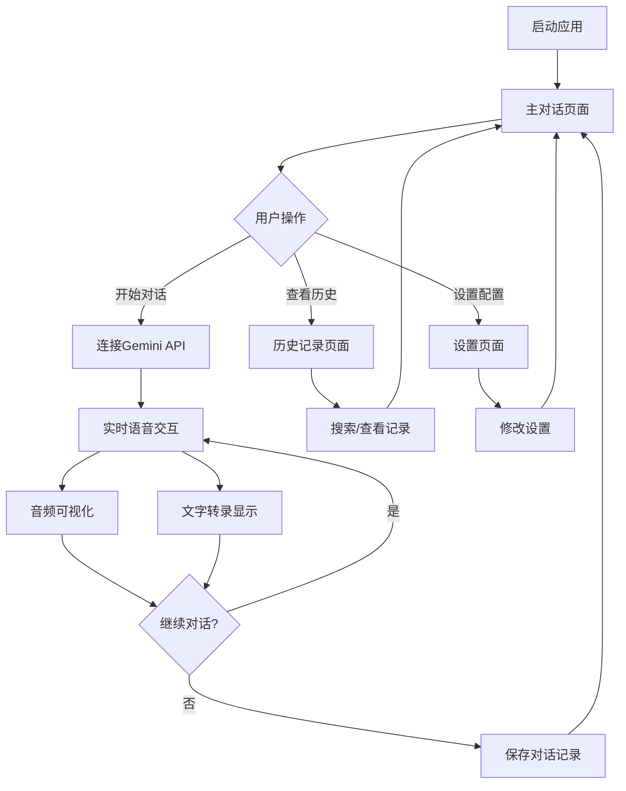

## 1. 产品概述
Gemini Live Voice PWA是一个基于Google Gemini-2.5-Flash-Live API的实时语音对话Web应用程序。用户可以通过语音与AI进行自然对话，支持实时语音转文字、文字转语音，提供流畅的交互体验。产品主要面向需要AI语音助手服务的移动端用户，解决传统文字交互效率低、体验不自然的问题。

目标市场：移动优先的AI语音助手应用场景，为用户提供随时随地的智能语音服务。

## 2. 核心功能

### 2.1 用户角色
| 角色 | 注册方式 | 核心权限 |
|------|----------|----------|
| 普通用户 | 无需注册，本地使用 | 基础语音对话、历史记录查看、设置管理 |

### 2.2 功能模块
我们的实时语音对话应用包含以下主要页面：
1. **主对话页面**：实时语音交互、音频可视化、文字转录显示
2. **历史记录页面**：对话历史列表、搜索过滤、详情查看
3. **设置页面**：API密钥配置、语音参数调整、主题切换、语言选择

### 2.3 页面详情
| 页面名称 | 模块名称 | 功能描述 |
|-----------|-------------|-------------|
| 主对话页面 | 语音交互区 | 实时语音输入输出，支持打断和连续对话，显示音频波形可视化 |
| 主对话页面 | 文字转录区 | 实时显示用户语音转录和AI回复内容，支持滚动查看 |
| 主对话页面 | 控制面板 | 开始/停止对话、清空对话、切换语音模式 |
| 历史记录页面 | 搜索过滤 | 按时间、关键词搜索历史对话记录 |
| 历史记录页面 | 记录列表 | 显示对话时间、时长、主要内容摘要 |
| 历史记录页面 | 详情查看 | 查看完整对话内容、重新播放音频 |
| 设置页面 | API配置 | 输入和管理Gemini API密钥，支持自定义端点 |
| 设置页面 | 语音设置 | 调整输入输出音频参数、选择语音模式 |
| 设置页面 | 界面设置 | 切换深色/浅色主题、选择界面语言 |
| 设置页面 | 高级选项 | 网络状态监控、缓存管理、性能优化 |

## 3. 核心流程
用户打开应用后进入主对话页面，点击开始按钮激活语音对话功能。系统通过WebSocket连接到Gemini Live API，实时传输音频数据。用户说话时被实时转录并发送给AI，AI的回复通过语音合成实时播放，同时显示文字转录。对话结束后自动保存到历史记录。

## 4. 用户界面设计

### 4.1 设计风格
- **主色调**：Material Design 3动态色彩系统，支持主题自适应
- **按钮样式**：圆角矩形，悬浮效果，Material You设计规范
- **字体系统**：Roboto字体家族，响应式字体缩放
- **布局风格**：卡片式布局，圆角设计，流畅动画过渡
- **图标风格**：Material Symbols，支持动画效果

### 4.2 页面设计概述
| 页面名称 | 模块名称 | UI元素 |
|-----------|-------------|-------------|
| 主对话页面 | 语音交互区 | 中央圆形麦克风按钮，带脉冲动画效果，音频波形实时显示在按钮周围 |
| 主对话页面 | 文字转录区 | 半透明卡片背景，自动滚动到底部，支持长按复制 |
| 主对话页面 | 控制面板 | 底部工具栏，包含开始/停止、清空、设置按钮，图标+文字组合 |
| 历史记录页面 | 记录列表 | 时间线式设计，卡片式记录项，显示时间戳和摘要 |
| 历史记录页面 | 搜索栏 | 顶部固定搜索框，支持语音输入，实时搜索结果 |
| 设置页面 | 设置分组 | 分组卡片布局，开关、滑块、输入框等Material组件 |

### 4.3 响应式设计
- **移动优先**：针对手机屏幕优化，触摸友好的交互设计
- **平板适配**：横屏模式下双列布局，更好的空间利用
- **桌面支持**：响应式网格系统，支持窗口大小调整
- **PWA特性**：可安装到主屏幕，全屏运行体验
- **触摸优化**：大按钮设计，防误触，手势操作支持