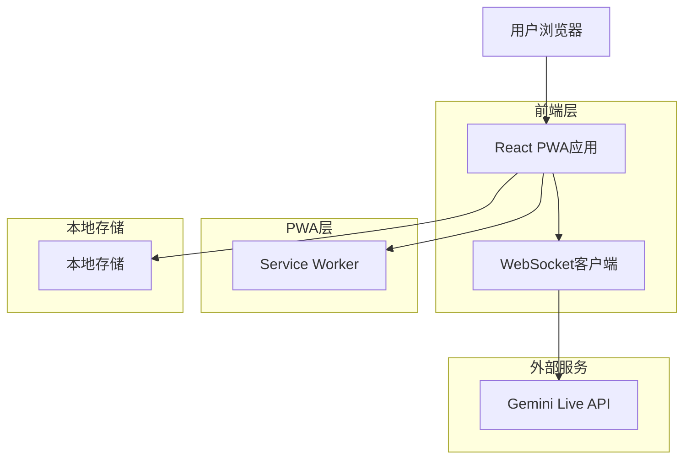
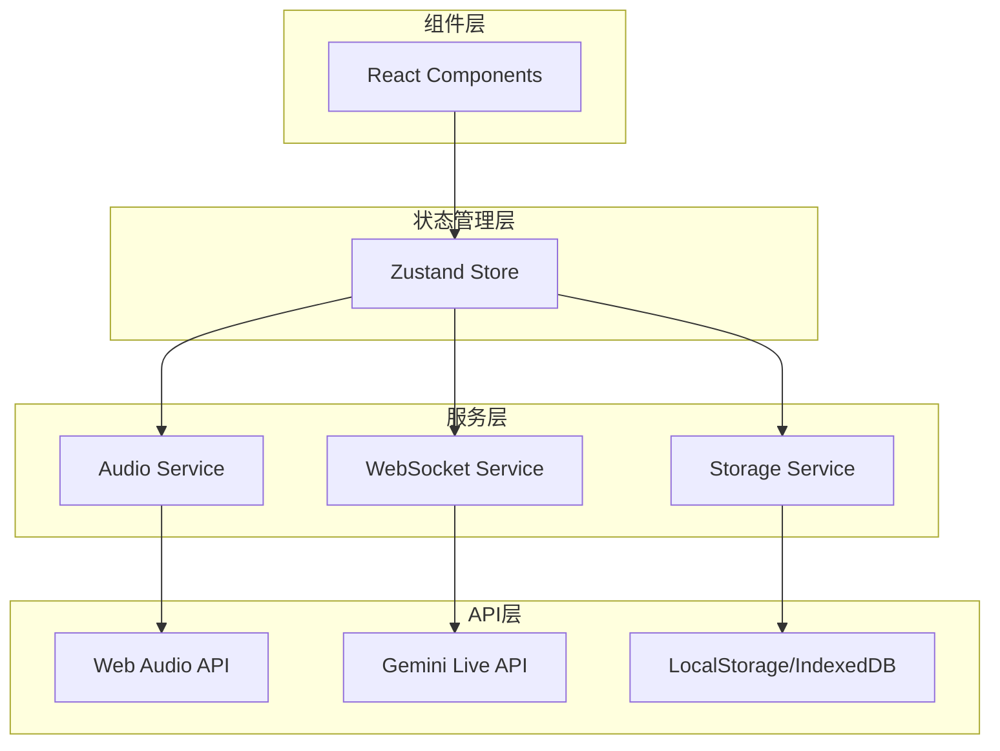

## 1. 架构设计



## 2. 技术栈描述
- **前端框架**: React@18 + TypeScript@5
- **构建工具**: Vite@5
- **状态管理**: Zustand@4
- **UI组件库**: Material-UI (MUI)@5
- **音频处理**: Web Audio API + MediaRecorder API
- **国际化**: react-i18next
- **PWA支持**: Vite PWA Plugin

## 3. 路由定义
| 路由 | 用途 |
|-------|--------|
| / | 主对话页面，实时语音交互界面 |
| /history | 历史记录页面，查看和管理对话历史 |
| /settings | 设置页面，配置API密钥和参数 |
| /about | 关于页面，应用信息和帮助文档 |

## 4. API定义

### 4.1 Gemini Live API集成
```typescript
// WebSocket连接配置
interface GeminiLiveConfig {
  model: string; // "gemini-2.5-flash-native-audio-preview-09-2025"
  apiKey: string;
  baseUrl?: string;
  voice?: {
    language: string;
    speed: number;
    pitch: number;
  };
}

// 音频格式定义
interface AudioFormat {
  sampleRate: number; // 输入16000Hz，输出24000Hz
  bitDepth: number; // 16位
  channels: number; // 单声道
  encoding: 'pcm' | 'wav';
}

// 实时消息协议
interface LiveMessage {
  type: 'input' | 'output' | 'tool' | 'error';
  timestamp: number;
  data: {
    audio?: ArrayBuffer;
    text?: string;
    metadata?: Record<string, any>;
  };
}
```

### 4.2 本地存储API
```typescript
// 对话历史记录
interface ConversationHistory {
  id: string;
  timestamp: number;
  duration: number;
  messages: LiveMessage[];
  summary: string;
}

// 设置存储
interface AppSettings {
  apiKey: string;
  baseUrl: string;
  theme: 'light' | 'dark' | 'auto';
  language: 'zh-CN' | 'en-US';
  audioSettings: {
    inputGain: number;
    outputGain: number;
    noiseSuppression: boolean;
    echoCancellation: boolean;
  };
}
```

## 5. 前端架构设计



## 6. 数据模型

### 6.1 状态管理模型
```typescript
// 应用状态
interface AppState {
  // UI状态
  isConnected: boolean;
  isRecording: boolean;
  isPlaying: boolean;
  currentTheme: 'light' | 'dark';
  currentLanguage: string;
  
  // 音频状态
  audioContext: AudioContext | null;
  mediaStream: MediaStream | null;
  audioVisualizer: AudioVisualizer | null;
  
  // 对话状态
  currentConversation: ConversationSession;
  conversationHistory: ConversationHistory[];
  
  // 设置
  settings: AppSettings;
}

// 对话会话
interface ConversationSession {
  id: string;
  startTime: number;
  endTime?: number;
  messages: LiveMessage[];
  audioBuffers: Map<string, ArrayBuffer>;
}
```

### 6.2 音频处理流程
```typescript
// 音频处理服务
class AudioService {
  private context: AudioContext;
  private recorder: MediaRecorder;
  private visualizer: AnalyserNode;
  
  // 初始化音频上下文
  async initialize(): Promise<void> {
    this.context = new AudioContext({
      sampleRate: 16000, // Gemini输入要求
      latencyHint: 'interactive'
    });
  }
  
  // 开始录音
  async startRecording(): Promise<MediaStream> {
    const stream = await navigator.mediaDevices.getUserMedia({
      audio: {
        sampleRate: 16000,
        channelCount: 1,
        echoCancellation: true,
        noiseSuppression: true,
        autoGainControl: true
      }
    });
    
    this.recorder = new MediaRecorder(stream, {
      mimeType: 'audio/webm;codecs=pcm',
      audioBitsPerSecond: 256000
    });
    
    return stream;
  }
  
  // 音频可视化
  createVisualizer(canvas: HTMLCanvasElement): void {
    this.visualizer = this.context.createAnalyser();
    this.visualizer.fftSize = 256;
    
    const draw = () => {
      const dataArray = new Uint8Array(this.visualizer.frequencyBinCount);
      this.visualizer.getByteFrequencyData(dataArray);
      
      // 绘制波形图
      this.drawWaveform(canvas, dataArray);
      requestAnimationFrame(draw);
    };
    
    draw();
  }
}
```

### 6.3 WebSocket服务
```typescript
// Gemini Live WebSocket客户端
class GeminiLiveClient {
  private ws: WebSocket | null = null;
  private config: GeminiLiveConfig;
  private messageHandlers: Map<string, Function> = new Map();
  
  constructor(config: GeminiLiveConfig) {
    this.config = config;
  }
  
  // 建立连接
  async connect(): Promise<void> {
    const url = `wss://generativelanguage.googleapis.com/ws/google.ai.generativelanguage.v1alpha.GenerativeService.BidiGenerateContent?key=${this.config.apiKey}`;
    
    this.ws = new WebSocket(url);
    
    this.ws.onopen = () => {
      // 发送初始化配置
      this.send({
        setup: {
          model: `models/${this.config.model}`,
          generation_config: {
            response_modalities: ["audio", "text"],
            speech_config: {
              voice_config: {
                prebuilt_voice_config: {
                  voice_name: "Aoede" // 或根据配置选择
                }
              }
            }
          }
        }
      });
    };
    
    this.ws.onmessage = (event) => {
      const response = JSON.parse(event.data);
      this.handleMessage(response);
    };
  }
  
  // 发送音频数据
  sendAudioData(audioBuffer: ArrayBuffer): void {
    if (this.ws?.readyState === WebSocket.OPEN) {
      // 将音频数据转换为base64
      const base64Audio = this.arrayBufferToBase64(audioBuffer);
      
      this.send({
        realtime_input: {
          media_chunks: [{
            data: base64Audio,
            mime_type: "audio/pcm"
          }]
        }
      });
    }
  }
  
  // 处理接收到的消息
  private handleMessage(message: any): void {
    if (message.serverContent) {
      const content = message.serverContent;
      
      if (content.modelTurn) {
        // 处理AI回复
        const parts = content.modelTurn.parts;
        parts.forEach((part: any) => {
          if (part.inlineData) {
            // 音频数据
            this.handleAudioResponse(part.inlineData.data);
          } else if (part.text) {
            // 文字回复
            this.handleTextResponse(part.text);
          }
        });
      }
    }
  }
}
```

## 7. PWA配置

### 7.1 Manifest配置
```json
{
  "name": "Gemini Live Voice",
  "short_name": "Gemini Voice",
  "description": "基于Gemini Live API的实时语音对话应用",
  "start_url": "/",
  "display": "standalone",
  "background_color": "#ffffff",
  "theme_color": "#1976d2",
  "orientation": "portrait",
  "icons": [
    {
      "src": "/icons/icon-192.png",
      "sizes": "192x192",
      "type": "image/png",
      "purpose": "any maskable"
    },
    {
      "src": "/icons/icon-512.png",
      "sizes": "512x512",
      "type": "image/png"
    }
  ],
  "features": [
    "microphone",
    "speaker"
  ]
}
```

### 7.2 Service Worker配置
```typescript
// vite.config.ts
export default defineConfig({
  plugins: [
    react(),
    VitePWA({
      registerType: 'autoUpdate',
      workbox: {
        globPatterns: ['**/*.{js,css,html,ico,png,svg,woff2}'],
        runtimeCaching: [
          {
            urlPattern: /^https:\/\/generativelanguage\.googleapis\.com\//,
            handler: 'NetworkFirst',
            options: {
              cacheName: 'gemini-api-cache',
              expiration: {
                maxEntries: 50,
                maxAgeSeconds: 60 * 60 * 24 // 24小时
              }
            }
          }
        ]
      },
      manifest: {
        // PWA清单配置
      }
    })
  ]
});
```